# Digibrake
https://github.com/skaugvoll/digibrake

## Motivasjon
Digibrake er et hobbyprosjekt jeg laget iløpet av påsken 2019.
Motivasjonen bak prosjektet er å lage et analogt håndbrekk som utgir seg for å være en joystick / gamepad, (f.eks Xbox 360 spill kontroller)
for Windows 10 maskiner, ved hjelp av Arduino. Håndbrekket skulle lages så billig som mulig, og derfor bare bruke Hardware (Arduino komponenter og treverk) jeg hadde fra før.

Dette prosjektet skal kombinere to av mine favoritt hobbier, programmering og treverk-produksjon. Derfor skulle jeg lage hele håndbrekket selv, alt fra programmering og design til komponentene / mekaniske delene.

For de som ikke vet hva en Arduino er, så er det i korte trekk
"n plattform for prototyping av elektronikk basert på program- og maskinvare med åpen kildekode" - Arduino.cc. For mer inforamsjon om Arduino kan du sjekke ut hjemmesiden deres [www.arduino.cc](www.arduino.cc).

## Planlegging
Siden jeg skulle laget håndbrekket så bililg som mulig, med hardware og treverk jeg fant slengene rundt, måtte designet og mekanikken bli noe annet en hva jeg fant av design og mekaniske løsninger på internett.

Fellesfaktoren mellom alle de allerede eksisterende designene som var på internett, var bruk av analog lineær "sliding" potensiometer (variabel motstand) og ferdigprodusert Hydraulisk håndbrekk.
Dette er hardware som kan koste veldig mye og kjøpe eller ta lang tid og motta ved handel på nett.
Linear sliding potentiometer kostet fra 14,-nkr og oppover, men da tar det flere månder og motta det.
Samme leveringstid på Hydraulisk håndbrekk men det kostet fra 300,-nkr og oppover, og mest vannlige prisen var rundt 600,-nkr.

Derfor valgte jeg og bruke et roterende potentiometer jeg hadde fra før, og heller lage en mekanisk løsning for å rotere potentiometer nokk til å få godt utslag på det, slik at spiller kunne mota et signal som varierte nokk, til å få forskjellig grad av håndbrekk og påføre bremsene.

### Design

#### Matriell
Matrialet brukt er;
- Kasse og gir er laget av Eine tre vokst og kappet hjemme på gården og er derfor kortreist.
- Frontvegg, bakvegg, toplokk og potensiometervegg er laget av tonet pleksiglass, rester i fra jeg
bygget en båt, og brukte tonet pleksiglass til vindu.
- Håndbrekkakselen er laget av et kappet kosteskaft i glassfiber.
- Håndbrekkspaken er laget av en metallstang som jeg gjenget selv.
- Håndbrekkhåndtaket er laget av Einetre.
- Fjærer er drafjærer og ikke trekkfjærer.

### Potentiometer Mekanismen
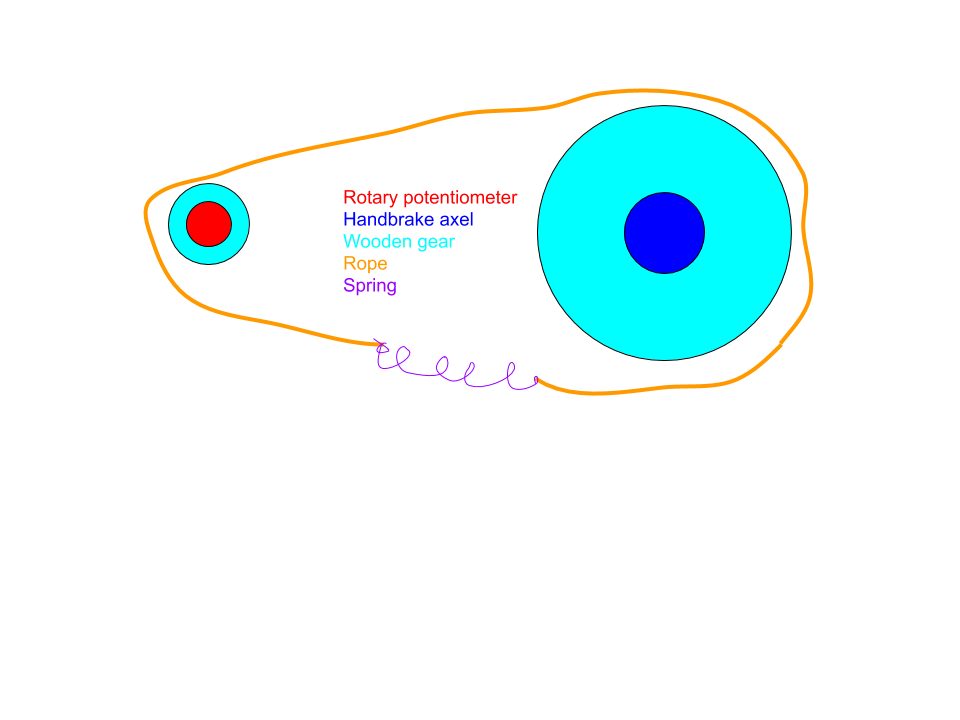
Ideen her er at håndbrekket er montert fast i en axel, så når man drar i håndbrekket roterer man axelen.
På axelen er det et gir. Potentiometer har også påmontert et gir. Her er det viktig at giret på akselen er større enn giret på potentiometeret. Dette er for at liten rotasjon på akselen skal gi større rotasjon på potentiometeret og dermed få mer utslag på potentiometer enn bevegelsen man trenger å gjøre med håndbrekket.
Koblingen mellom girene er en sterk trå eller tau som er montert strammt rundt girene. Her kan man bruke vulkaniserende teip for å få mer friksjon mellom strengen og girene, slik at man sørger for at girene blir rotert. For å sørge for at strengen er stram til en hver tid og giret på potentiometer blir trukket til bake (slik at man går tilbake til ingen potentiometer utslag), er strengen kortere en det som trengs, og blir holdt stram og sammen av en sterk fjær.

### Håndbrekk Mekanismen
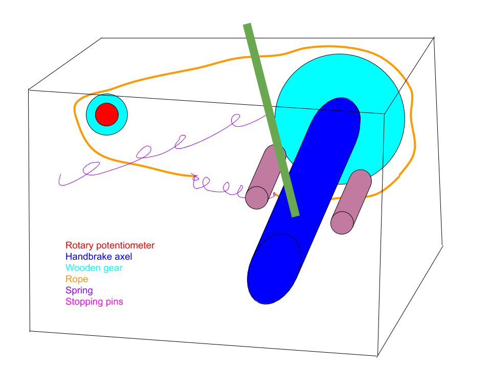
Her er begge mekansimene satt sammen, selve håndbrekkspaken er montert fast i akselen som roterer girene,
for å sørge for at når man slipper håndbrekkspaken, så går den tilbake til hvileposisjon, og roterer girene og potentiometer tilbake til null-posisjonen, er det montert en fjær fast i selve veggen og håndbrekkspaken.

## Utførelse
### Lage treverk-komponentene
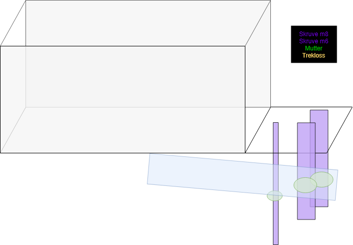
Bygge veggene, gulv og tak er veldig lett. bestemm deg for en ønsket lengde og høyde, kapp treverk i korrekt størrelse. Det viktige her er og lage bunnen lengre enn toppen og veggene, slik at vi kan bygge på mekanismen for å sette fast håndbrekk-kassen på et bord.
Ideen er en klemme, bestående av 3 skruver.
De to tykkeste skruvene (se bilde) bestemmer tykkelsen på bordet, hvor mutteren er mellom selve kassen og klemmen, og presser nedover. Den tynneste skruven er den som bestemmer hvor hardt klemmen skal klemme, og er montert på undersiden av klemmen og presser klemmen oppover. Noe som gir et stramt grep.

Det er viktig og huske å skjære spor i lokket til håndbrekkspaken sin bevegelse, dette sporet kan brukes som stoppere for spaken også, og dermed slippe å lage de tappene man ser på bildene over.

### Tenningslås
Hvis man vil kan man bygge på videre, slik jeg har gjort, ved å legge til f.eks en boks som inneholder en tenningslås. (se bilder under Ferdig Design). For å koble sammen Arduino med tenningslåsen, brukte jeg KREG lommehullsjigg.

## Ferdig Design
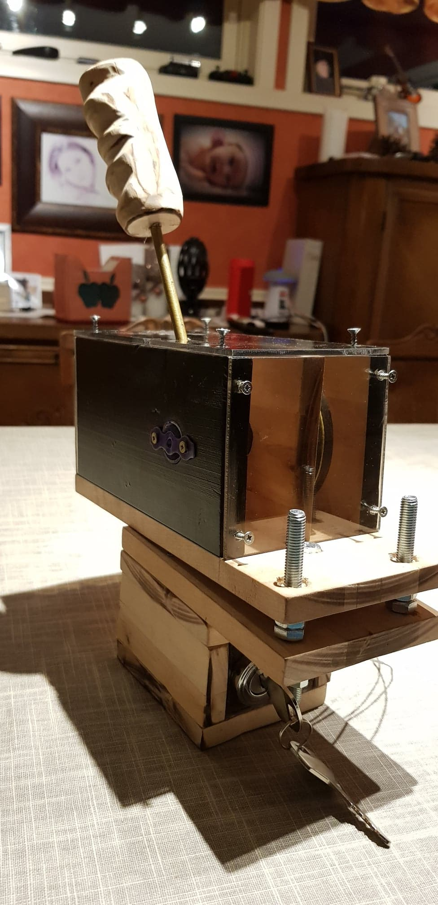

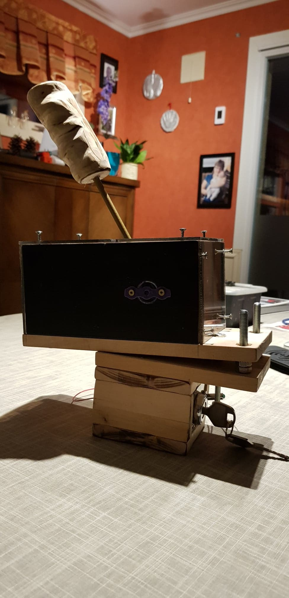

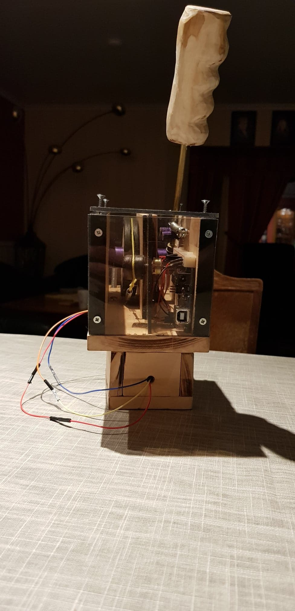

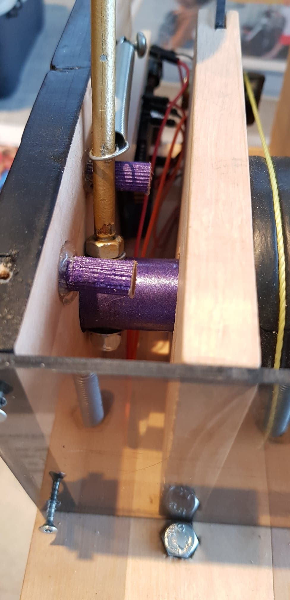

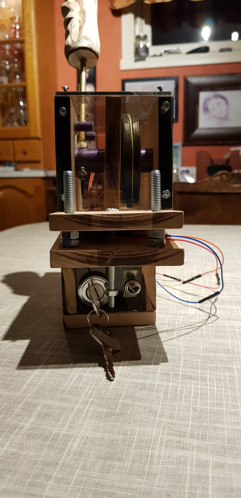

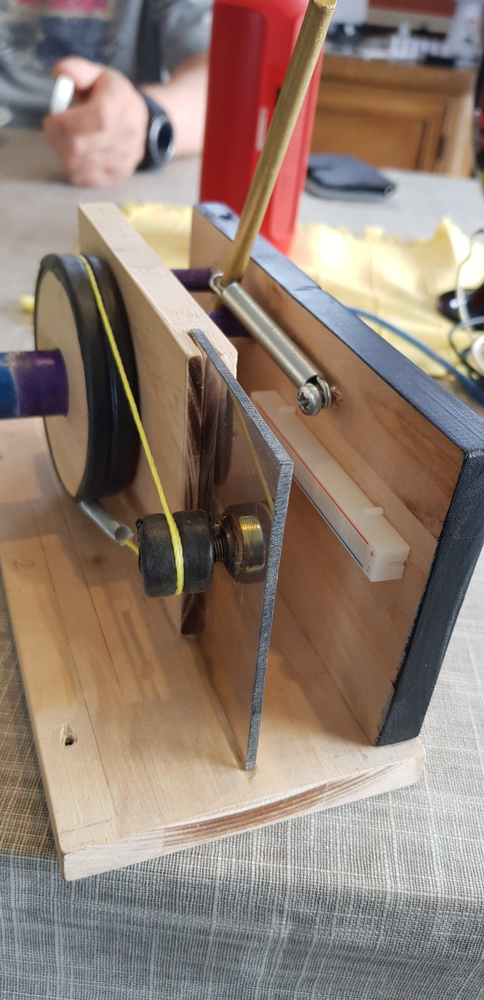

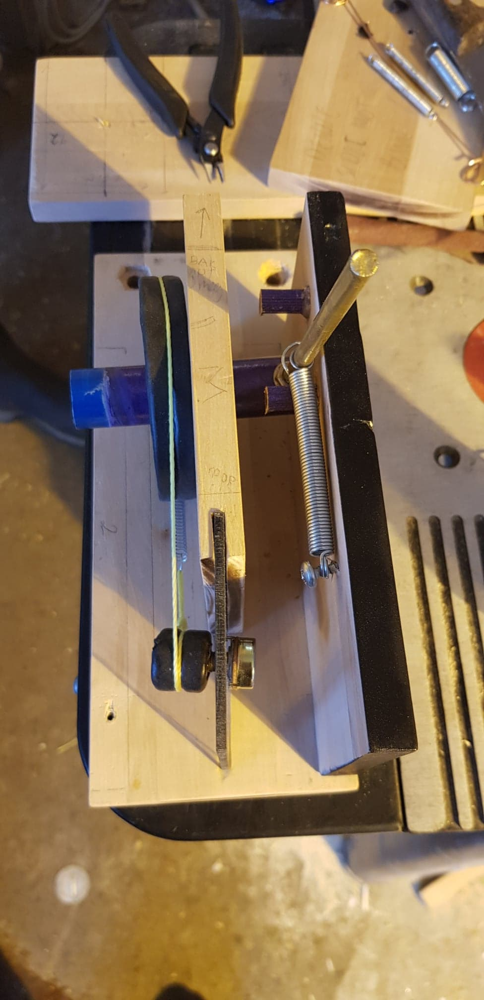

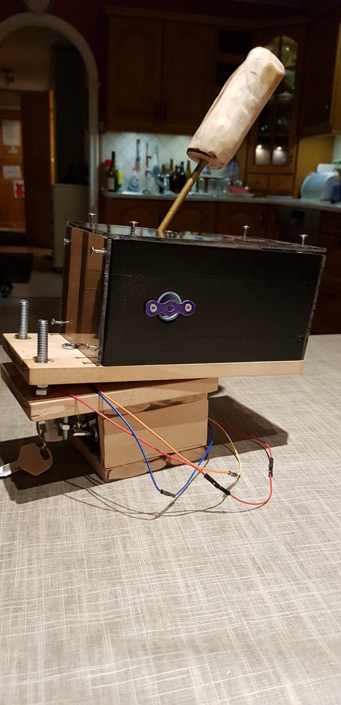

## Programmering
Designene på internett brukte Arduino Micro eller Arduino Leonardo, men siden jeg bare hadde en Arduino Uno liggende, måtte jeg gjøre det beste ut av det. Ulempen med Arduino Uno er at den ikke støtter HID-biblioteker. Jeg fant to prosjekt på Github av Nico Hood (https://github.com/NicoHood/HID og https://github.com/NicoHood/HoodLoader2), som tillater deg og reflashe Arduino Uno sin 16u2 chip til å støtte HID biblioteker.

Etter å ha reflashet chippen funket Nico Hood sitt HID bibliotek.
For instruksjoner på hvordan reflashe Arduino Uno med Nico Hood sitt bibliotek, anbefaler jeg å bruke hans instruksjoner på Github, samt har jeg laget egen instruksjoner på mitt prosjekts Github.
Jeg fant ut at for å kunne bruke AnalogRead (lese potentiometer) på den reflashete chippen, måtte man bruke den vanlige chippen til å lese potentiometere, også sende verdiene fra den chippen til 16u2 chippen via **Serial**. Dette er nødvendig fordi 16u2 chippen har bare **Digitale** pinner.

Koden for Digibrake prosjektet finner du på mitt Github prosjekt, Digibrake (https://github.com/skaugvoll/digibrake). Koden for Arduino Uno, ligger under mappen ioToMCU

Koden funker med håndbrekk og tenningslås, men jeg oppdaget at grunnen til at alle andre bruker Arduino Micro eller Leonardo, er fordi Arduino Uno med min fremgangsmetode blir veldig treg på lesing og sending av potentiometer verdier, med andre ord mye input lag.
Derfor vil jeg anbefale å bruke en av de to andre Arduinoene samt at man slipper å reflashe Arduino Uno.

### Uno til Micro eller Leonardo
Å adoptere koden til Arduino Uno under ioToMCU, er ganske enkelt. Installer ett nytt bibliotek for HID, som er utviklet av Matthew Heironimus (https://github.com/MHeironimus/ArduinoJoystickLibrary), også erstatte HID imports med Joystick, og endre alle Gamepad kall med Joystick bibliotek kall.
De metodene man trenger er pressButton og releaseButton.

Eksempler på dette finnes under mappene MicroHandBrakeJoystick og LeonardoHandbrake_starter_and_LED.

### Schematics
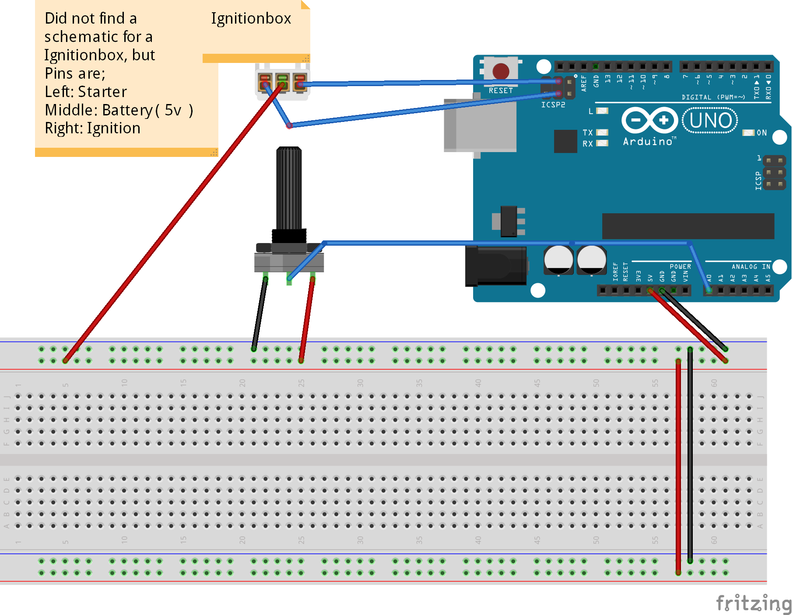

## Ettertanker
I etterkant, kjøpte jeg en billig Arduino Micro og Leonardo for å teste forskjellen til Arduino Uno.
Jeg merket stor forskjell i input lag og håndbrekkerespons ble tilnærmet med engang. Testet håndbrekket på spill som Forza Horizon 4 og diverse andre, og merket ikke noe input lag, og er svært fornøyd med prosjektet og valgte derfor å gjøre det offentlig, slik at andre sim-racing entusiaster kan lage sitt eget håndbrekk, så billig som mulig og uten å gjøre samme feiler som meg.

Hvis du har noen spørsmål er det bare å ta kontakt ved å sende mail til sigve@skaugvoll.com, så skal jeg prøve å svare så godt jeg kan.

Happy racing!

#### PS!
If software does not work, I'm sorry, let me know and I will try to fix it!
I'm currently using the MicroHandBrakeJoystick code, and it works great.
